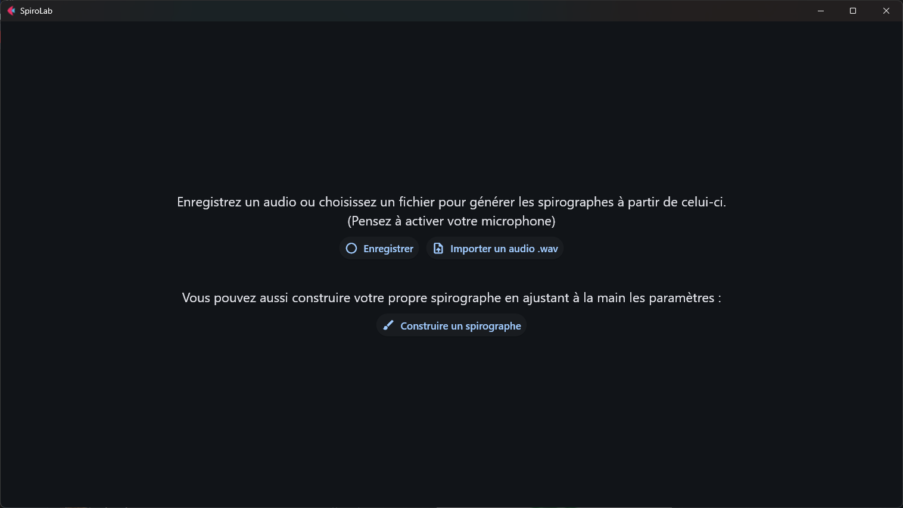

# Exemples d'utilisation
L'interface de l'application est divisée en 4 pages navigables :

## Page de garde

Après la fin de l'animation, la page de garde ressemble à l'image ci-dessus. Pour accéder au reste de l'application, cliquer en bas à droite sur le bouton "Commençons".

## Page d'enregistrement

Les différentes options proposées : 

Commencer un enregistrement / importer un fichier

Quand l'enregistrement est fini, cette page s'affiche :

## Page de vidéo

La page qui affiche les spirographes générés : on peut passer à la dernière page depuis celle-ci

## Page de création personnalisée

La page de création personnalisée, avec des valeurs différentes de celles par défaut : pour modifier les paramètres, utiliser les sliders.